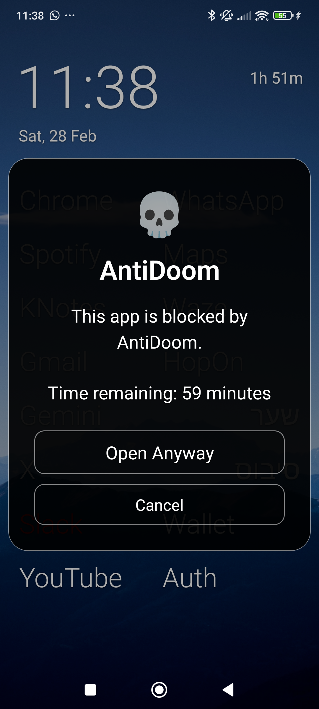
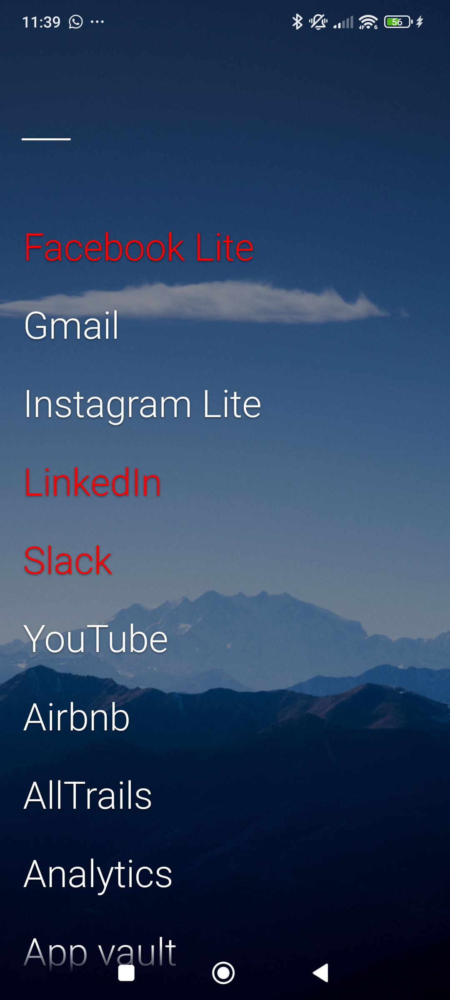

# Olauncher | Minimal AF Launcher (Forked)
AF stands for Ad-Free :D

This is a **fork** of the original [Olauncher](https://github.com/tanujnotes/Olauncher) by @tanujnotes. It includes custom enhancements like visual AntiDoom block indicators and improved screen time management.

Olauncher is a minimal, open-source launcher for Android that helps you reduce your screen time and focus on what matters.

## Screenshots
| Home Screen | AntiDoom Block | App Drawer |
| :---: | :---: | :---: |
|  |  |  |

## Install
You can build the APK from source using the provided Gradle wrapper.

To maintain the simplicity of the launcher, a few niche features are available but hidden.
Please check out the [About](https://tanujnotes.substack.com/p/olauncher-minimal-af-launcher?utm_source=github) page in the Olauncher settings for a complete list of features and FAQs.

## License
License: [GNU GPLv3](https://www.gnu.org/licenses/gpl-3.0.en.html)

Original project by @tanujnotes | [X/Twitter](https://twitter.com/tanujnotes) | [Bluesky](https://bsky.app/profile/tanujnotes.bsky.social)
